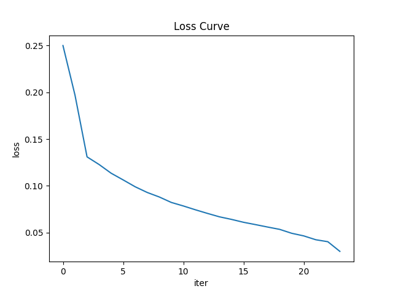
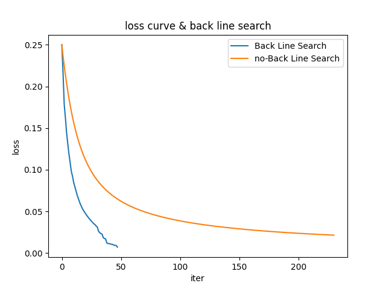
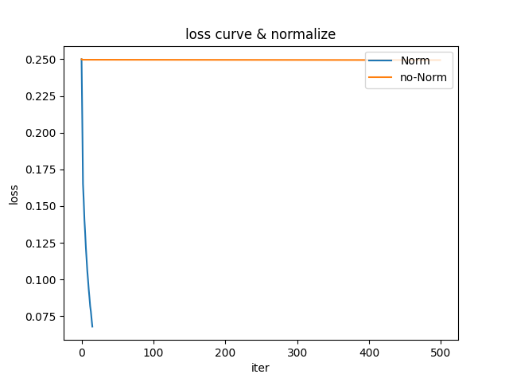
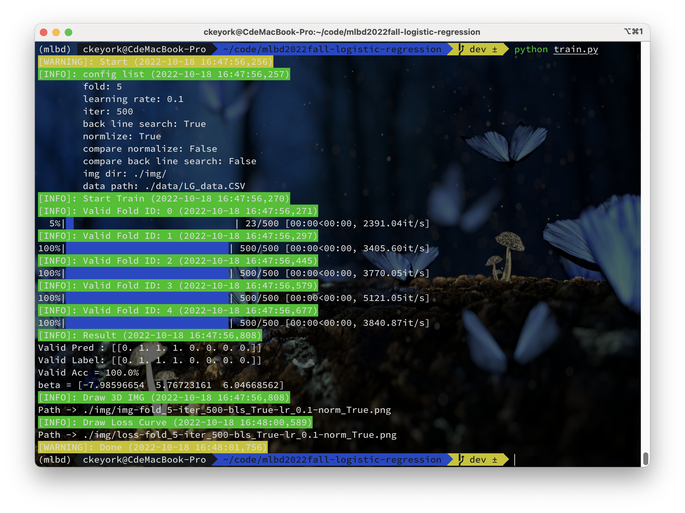
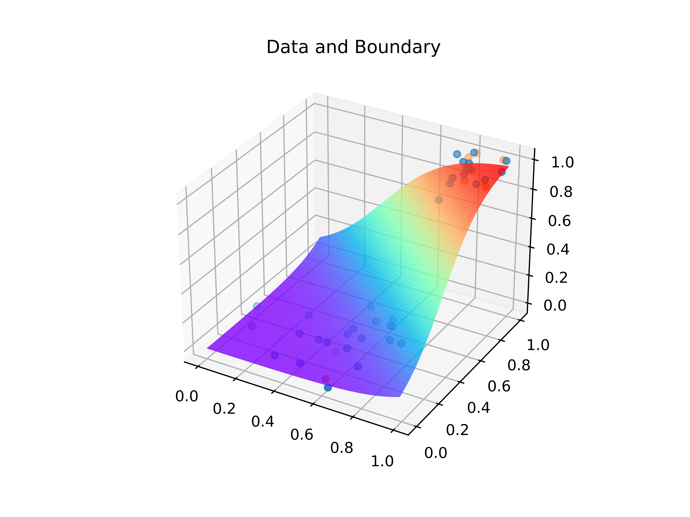

# mlbd2022fall-logistic-regression
Machine Learning & Big Data 2022 Fall homework 2: logistic regression

https://github.com/keyork/mlbd2022fall-logistic-regression

## Task

See [task.md](task.md).

## Usage

```bash
pip install matplotlib numpy pandas colorlog tqdm
python train.py -h
python train.py --args ARGS
```

## Model

### Log-likelihood

$$
\mathcal{L}(\beta)=\sum_{i=1}^{m}y_i\mathrm{log}\left(\frac{1}{1+e^{-\beta^T\mathbf{x}}}\right)+(1-y_i)\mathrm{log}\left(1-\frac{1}{1+e^{-\beta^T\mathbf{x}}}\right)
$$

$\beta=[\beta_0,\beta_1,\beta_2]^T$

$\mathbf{x}=[x_0,x_1,x_2]^T\quad (x_0=1)$

### Regression

$$
\beta^{(k+1)}=\beta^{(k)}+\alpha\left[y_i-g(\beta^{(k)^T})\mathbf{x}_i\right]\mathbf{x}_i
$$

$$
f_\beta(\mathbf{x})=\frac{1}{1+e^{-\beta^T\mathbf{x}}}
$$

### Find boundary pseudi-code

```pseudocode
procedure LOGISTICREGRESSION(dataset, beta)
	for data, label in dataset
		beta += alpha*(label-data/(1+exp(-beta*data)))*data
  end for
end procedure
```

### 5-fold

Split all data into 5 parts, each part is used as val-set, and the rest is used as train-set, compare the MSE-Loss of 5 times train and select the smallest as the best model.

### Norm

$$
x = \frac{x-x_{min}}{x_{max}-x_{min}}
$$

### Back Line Search

See [hw1: minibatch-sgd](https://github.com/keyork/mlbd2022fall-minibatch-sgd).

## Experiments

### logistic regression

Using normalize, 5-fold and back line search, we get the boundary by logistic regression and plot it in 3D, plot its loss curve(Fig. Left).

### Ablation Experiment

Remove back line search(Fig. Middle), normalize(Fig. Right) and compare them with initial experiment.



## Result



$\beta=[\beta_0,\beta_1,\beta_2]^T=[-7.98596654,5.76723161,6.04668562]^T$
